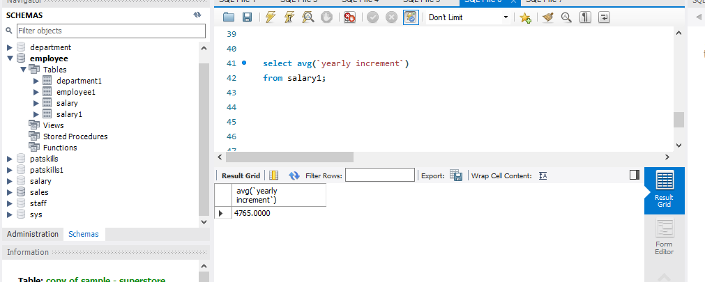
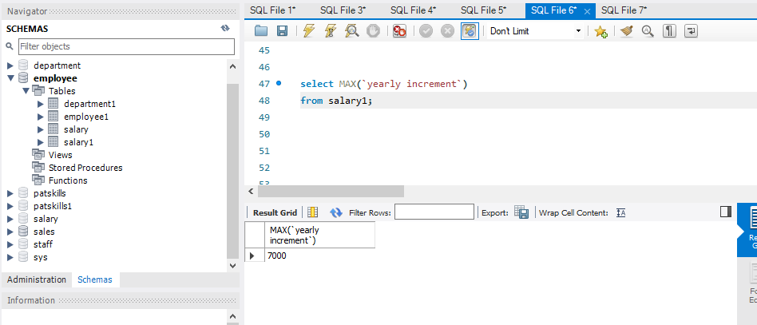
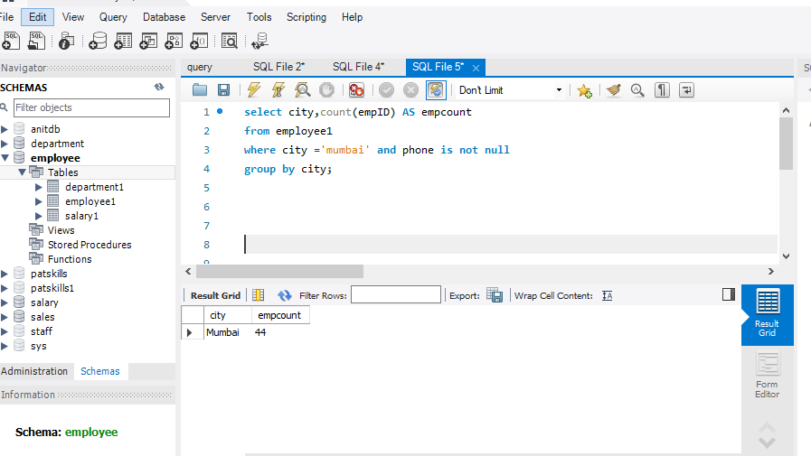
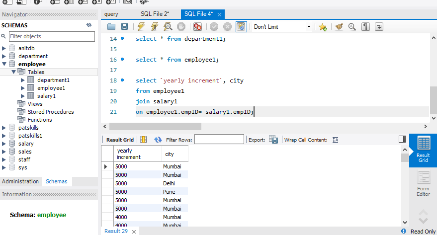
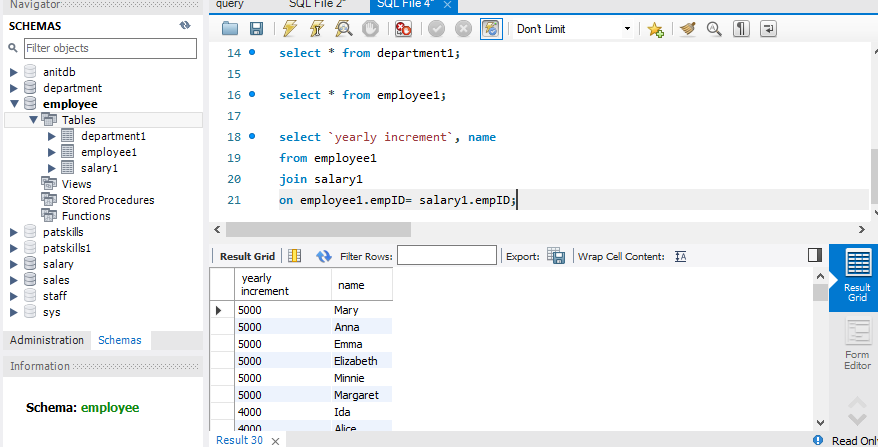
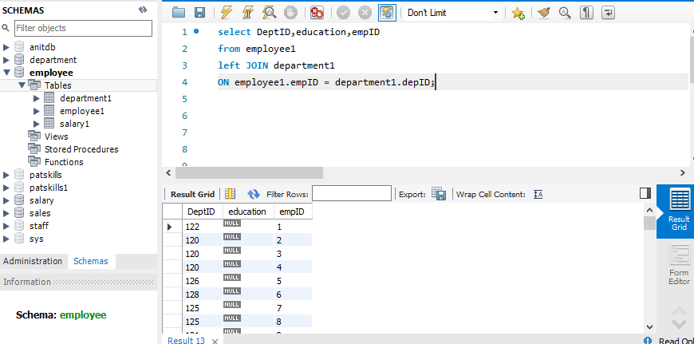
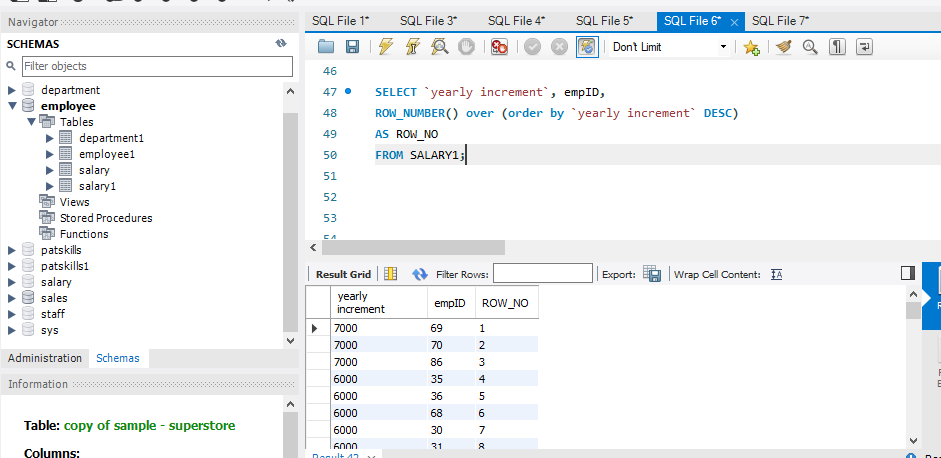
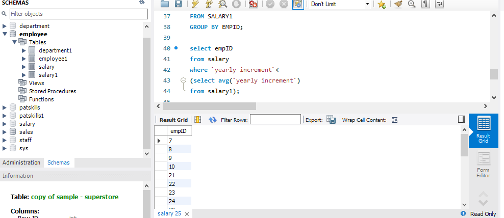
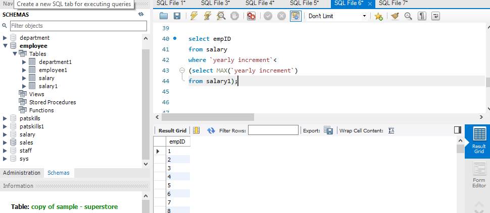
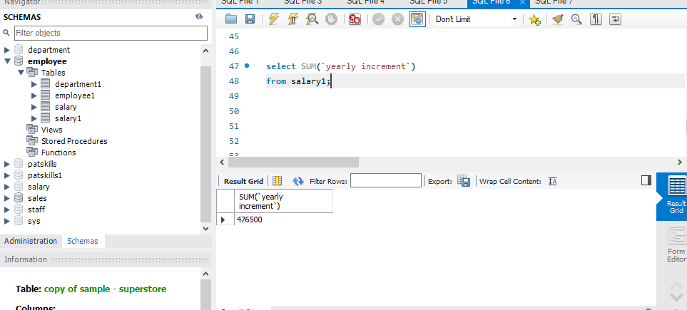

# SQL-PROJECT
## COME UP WITH 10 CRITICAL BUSINESS QUESTIONS AND PROVIDE THEIR ANSWERS USING THE EMPLOYEE,SALARY AND DEPARTMENT DATASETS
## WITH THE FOLLOWING COMMANDS 
** AGGREGATE FUNCTION
** GROUP BY
** ROW_NUMBER
** JOIN
** SUBQUERY

# USING AVERAGE
## What is the total average of the yearly increment

# USING MAX
## What is the highest yearly increment?

# USING GROUP BY
## What is the number of employees in Mumbai and their city?

# USING JOIN
## Run a query to return the yearly increment from salary table and the cities of the employees from the employee table

# USING JOIN
## Run a query to return the names of the employees from the employee table and the cities of the employees from the employee table

# USING LEFT JOIN
## Run a query to return all values in the left table and the corresponding matching value in the right table 

# USING ROW NUMBER
## Row number assigns unique value to each row, regardless of whether the rows are tied or not

# USING SUBQUERY
## Return the avg (yearly increment) using subquery

# USING SUBQUERY
## Return the maximum ( yearly increment) using subquery

# USING SUM FUNCTION
## Return the total sum of the yearly increment

